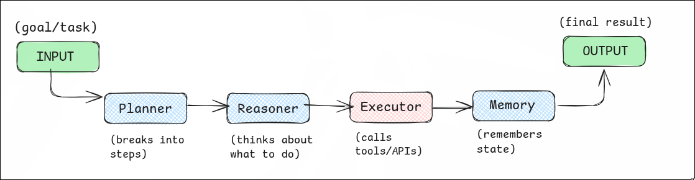

+++
authors = ["ryu"]
title = "Agentic AI: planning, reasoning, and acting with Autonomy"
description = "An exploration of Agentic AI — how modern LLM-powered agents can reason, plan, and take autonomous actions using memory, tools, and workflows."
date = 2025-07-19
updated = "2025-07-19"
[taxonomies]
tags = ["AI agents", "agentic AI", "LLM", "langchain"]
[extra]
toc = true
go_to_top = true
katex = false
featured = true
toc_inline = true
toc_ordered = true
disclaimer = """All views are educational in nature."""
+++

## What is an Agentic AI 

**Agentic AI** refers to systems that _don't_ just answer questions, but can plan, decide, and act on their own.

They use LLMs + Tools + Memory to handle Multi-Step Tasks without being told exactly what to do at each step.

### For example: 
* You say "**Book me a trip to Delhi this weekend under Rs.5000.**"
    * An ___Agentic AI__ might_:
        - Search for flights & buses.
        - Check Hotels.
        - Compare Costs. 
        - Make bookings via APIs.
        - Email you the plan.

    * Now, this is way beyond just generating text - this is actual **Decision + Action**.

---

## Characterstics of Agentic AI:

1. **Goal-Oriented Planning** 
    - It starts **with a goal**, then breaks it into smaller steps and executes.

2. **Multi-Step Reasoning**
    - It doesn't stop at one reply - it _iteratively_ reasons until the goal is met. 

3. **Autonomous Decision-Making** 
    - It chooses **the best path** or the tool on its own, based on the whatever context it has in that situation.

4. **Uses Memory, Tools and Knowledge**
    - Remembers Past Events (long term memory or conversational memory), uses APIs/Scripts (tools), and refers to the docs or rules (Knowledge Base).

---

## What makes Agentic AI different from Basic LLMs? 

* Normal LLMs (Chat GPT, Gemini, Perplexity etc.) are **Passive**:
    - They just respond to a prompt. 
* Agentic Systems are **Active**:
    - They observe, think, plan, act, and even revise their actions.

---

## Basic Agentic Structure

<figure>

<figcaption>Architecture of an Agentic AI</figcaption>
</figure>

 

---

## Agentic AI VS AI Workflow

| Term          | What it means                                  |
| ------------- | ---------------------------------------------- |
| AI workflow   | Pre-defined steps using AI (e.g. RAG pipeline) |
| Agent         | Dynamic reasoning & acting system that **adapts**  |
| ReAct Agent   | *Reason + Act*: Think, Decide, take Action     |
| Control logic | Like if/else to guide actions                  |
| Tools         | External Functions/APIs                        |
| Memory        | Past info/context retained                     |
| Planner       | Creates a step-wise plan                       |

---

## LLMs in this context 

* **LLMs** (like GPT, Gemini, Claude) are the **Core Brains** of the system. 
* But on their own, they can't remember, act or plan.
* We wrap them in **Agents** to extend their _ability_.

---

## Agentic AI Example 

1. **AI Coding Assistant**
    - Can Understand bug report, edits code, runs tests, commits. 
2. **Travel Agent**
    - As we have already seen the example above; There are a _gazillion_ use-cases of Agentic AI in various domains. 
3. A few more examples would be an _HR Onboarding Bot_, An Agent that posts for you on LinkedIn, the list _goes on_~

---

## Let's recap 

* LLM = **Brain** 
* Agent = **Brain + Body**(Tools/Memory/Planner)
* Agentic AI = **Autonomous Worker** that thinks and achieves **_any goal_** given to it
* Multi-Turn Planning = Not just simple answers, but _strategic answers_ driven by context
* ReAct Loop = **Reason -> Act -> Observe -> Repeat**. 

 


Before finishing up this blog; I would like for you to read this [Amazing Blog by Anthropic on building Agentic AI](https://www.anthropic.com/engineering/building-effective-agents).
