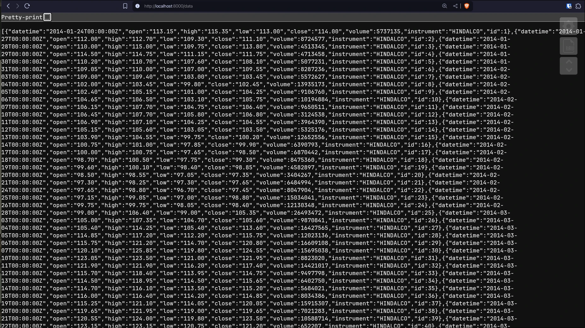
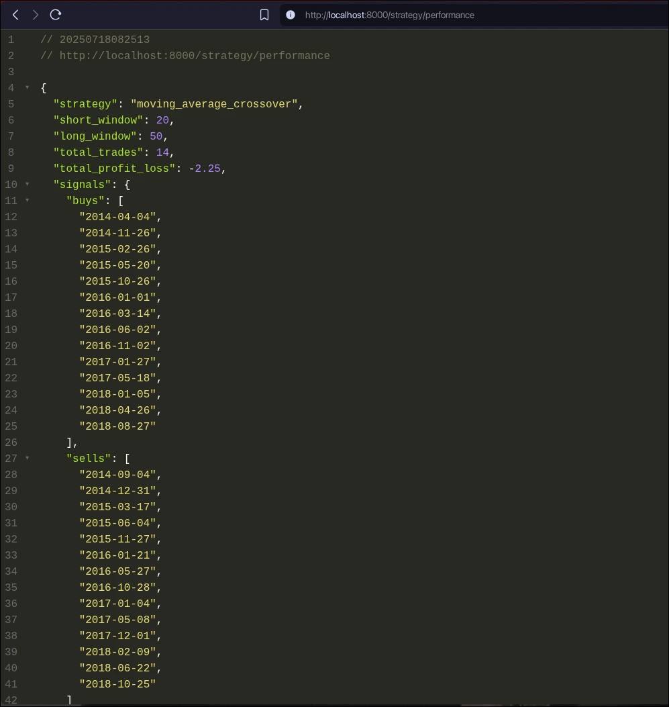
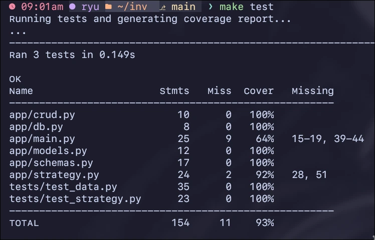

+++
authors = ["Alok (ryu)"]
title = "Building a Containerized Financial Data API with FastAPI and Docker"
description = "A backend project featuring FastAPI, PostgreSQL, and Docker, with a tested moving average crossover trading strategy."
date = 2025-07-18
updated = "2025-07-18"
[taxonomies]
tags = ["python", "fastapi", "docker", "postgresql", "sqlalchemy", "projects"]
[extra]
toc = true
go_to_top = true
katex = true
hot = true
toc_inline = true
toc_ordered = true
# disclaimer = """ """
+++

--- 

## How it started? 

Yesterday, I received a backend assignment from Invsto. the goal was to build a containerized API service that could store, serve, and analyze Stock price data.

---

## What's inside?

I built a complete FastAPI backend with the following key components:

* a **PostgreSQL** database to store time-series price data
* a clean rest **API** to ingest and retrieve it
* a *moving average crossover strategy* to analyze market trends
* **unit tests** with over **_90% coverage_**
* a fully **dockerized** environment, orchestrated via **make** commands

but beyond the checklist, what made this project worthwhile was how it *felt* like building something production-ready—debugging tests, handling edge cases, and documenting everything like it mattered; because I had planned to log it in this blogging website (finally)

---

## The Trading Logic!

at the core is a simple but **Effective Trading Strategy**:

* take two moving averages—one short (20-day), one long (50-day)
* when the short average crosses *above* the long, that’s a **Buy** signal
* when it crosses *below*, that’s a **Sell**

the system scans the data for crossover points and calculates basic profit/loss from those trades. simple logic, but implementing it cleanly, testably, and in a way that integrates into an API—that's where the challenge lies.

---

## Uff! Bugs

### 🐞 Test DB nightmare

Early on, tests kept failing even though they used a separate sqlite database. turned out they were accidentally connecting to the dev postgres container—resulting in state bleed and weird errors.

**fix**: I updated the test setup to fully isolate the sqlite test DB, and cleaned stale containers using `make down`.
**lesson**: To double-check your test environment assumptions.

---

### 🐞 Strategy returns “0 trades”

My tests expected a buy signal—but the logic returned nothing.

**fix**: Turns out my strategy only counts *full trades* (buy + sell). the test data had a buy signal, but no corresponding sell. I had to redesign the test to simulate a full market cycle.
**lesson**: Test data should reflect the exact logic you’re testing—not just part of it.

---

## Reflections ~

This project taught me a lot—not just about FastAPI, Docker, or (_specially_)**pandas**—but about treating small assignments like real systems. the biggest win wasn't just getting it to work, but making it clean, testable, and explainable.

---

## Visuals
> There is a live recorded demo in the GitHub Repo as well!

### raw data

---

### strategy performance

---

### test coverage

---

## source code

check out the full code, project structure, and setup instructions here:
**[github.com/ryu-ryuk/inv](https://github.com/ryu-ryuk/inv)**

